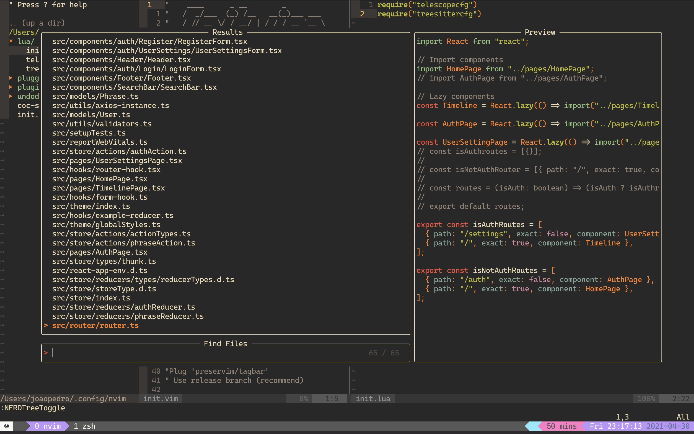

# Configs used by BitInByte

██████╗░██╗████████╗██╗███╗░░██╗██████╗░██╗░░░██╗████████╗███████╗
██╔══██╗██║╚══██╔══╝██║████╗░██║██╔══██╗╚██╗░██╔╝╚══██╔══╝██╔════╝
██████╦╝██║░░░██║░░░██║██╔██╗██║██████╦╝░╚████╔╝░░░░██║░░░█████╗░░
██╔══██╗██║░░░██║░░░██║██║╚████║██╔══██╗░░╚██╔╝░░░░░██║░░░██╔══╝░░
██████╦╝██║░░░██║░░░██║██║░╚███║██████╦╝░░░██║░░░░░░██║░░░███████╗
╚═════╝░╚═╝░░░╚═╝░░░╚═╝╚═╝░░╚══╝╚═════╝░░░░╚═╝░░░░░░╚═╝░░░╚══════╝

## Screen



## External Dependencies

1. Vim-Plug
2. Tmux
3. Neovim nightly (0.5) or Vim 8
4. ripgrep: https://github.com/BurntSushi/ripgrep (if neovim) => used in Telescope
5. Cascadia code font
6. Python autopep8 is required to pretify
7. Powerlevel10k (terminal)

## Config installation

You can install this config for both ViM and Neovim and should work for both.

If you want to install for ViM, you should download this config and inside of this config directory, you should run the following command:

```
sudo ./start.sh install vim
```

If you want to install for Neovim, you should download this config and inside of this config directory, you should run the following command:

```
sudo ./start.sh install neovim
```

## Some useful commands

### Java Commands

To compile our standalone project here is the command which we should execute it inside of our src folder to read correctly the packages:

```
javac --class-path . com/company/Main.java -verbose -d ../output/production/
```

This command will output the files to a folder called output/production which can be executed, again, inside of our production folder with the following command:

```
java com.company.Main
```

For maven and gradle projects, there is a coc command to do so:

```
:CocCommand java.workspace.compile
```

### Treesiter Commands

For treesitter, only for neovim, you can install language interpreter by :TSInstall <language>
